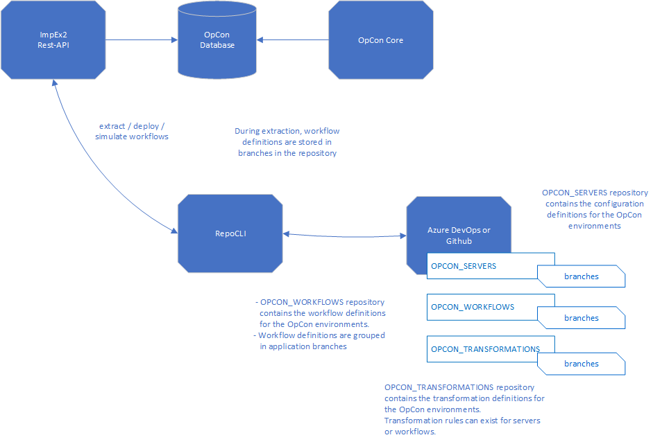

# Repo Client

Latest version of the Repo Client software is **23.0.0**.

The Repo Client software is a standalone CLI that can be used to extract, deploy and simulate OpCon workflow definitions using either Github or Azure DevOps as the repository for storing
the workflow definitions.

The RepoClient communicates with the SMA OpCon ImpEx2 Rest API Server to either extract, deploy or simulate definitions and with Github or Azure DevOps to retrieve or paste the definitions
using the respective Rest API.

- **extract** process is used to extract definitions from an OpCon system and save the definitions to a newly created branch in the repository.
- **deploy** process is used to insert or update a definition from the repository in a target OpCon system. During the process transformation rules may be applied to the definitions to match the definition to the target OpCon system.
- **simulate** process can be used to test the insert or update of a definition in a target system. During the process transformation rules may be applied to the definitions to match the definition to the target OpCon system. The simulate process performs definition compatibility, agent, agent group, role, user, agent features and dependency checks.

The implementation uses three repositories within the Github or Azure DevOps environment.

## OPCON_SERVERS
This repository is used to store information about the OpCon systems participating in the RepoClient environment. 
It contains a **servers** branch which has a json file for each OpCon system in the environment. The json file contains the configuration information for accessing the OpCon system.

## OPCON_WORKFLOWS
This repository is used to store the OpCon workflow definitions extracted from the OpCon systems. 
The repository should contain a branch for each application (i.e. **applone**) and the Workflows definition are stored as json files.
Splitting the workflows according to applications, allows the RepoClient to insert all workflow definitions within an application group in one command).  

## OPCON_TRANSFORMATIONS
This repository is used to store the transformation rules that are used to modify the OpCon workflow definition during the deployment process. The repository contains **servers** and **applications** branches. The **servers** branch contains json transformation rule files with a file for each defined OpCon system. The **applications** branch contains json transformation files for each application defined in the OPCON_WORKFLOWS repository.

# Repository Structure
The branches and naming conventions play a significant role in the ability of the REoClient client to function correctly. Specific branches are defined within the repositories and these are used by the processes to perform the selected tasks.

The Repository structure requires three repositories **OPCON_SERVERS**, **OPCON_WORKFLOWS** and **OPCON_TRANSFORMATIONS**.

The OPCON_SERVERS repository requires a **servers** branch which contains a json file for each OpCon system within the environment. This file contains the required information to establish connections to the OpCon system. In the above diagram, the repository shows the servers branch containing two json configuration files for OpCon systems opcona.json and opconb.json.

The OPCON_WORKFLOWS repository requires a branch for each application group and workflow definitions are stored in the branches using the workflow name (without special characters). In the above diagram, the repository shows two branches **appone** containing json workflow definition files definitiona.json and definitionb.json and **apptwo** containing json workflow definition files definitionc.json and definitiond.json.

The OPCON_TRANSFORMATIONS repository requires two branches **servers** and **applications**. These branches contain json format files that are used to transform definitions. It is important to understand that the transformation rules for servers and applications are applied to the workflow definitions.  

The servers branch contains transformation rules associated with the OpCon system (typically agent names, agent group names, user names, etc) and the naming convention is to use the same name used in the OPCON_SERVERS repository. In the above diagram this means that the transformation rule definitions in the /servers/opcona.json file will be associated with each deploy or simulation request to the opcona system. 

The applications branch contains transformation rules associated with the application group and the naming convention is to use the branch name name used in the OPCON_SERVERS repository as the json transformation rule name. This means that all transformation rules associated with an application must be contained in a single file. In the above diagram this means that the transformation rule definitions in the /applications/appone.json file will be associated with each deploy or simulation request for workflow definitions in the appone branch of the OPCON_WORKFLOWS repository.
