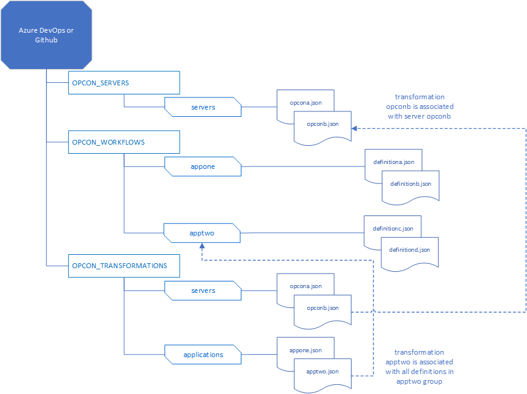

# Transformations

Workflow definitions are stored in the OPCON_WORKFLOWS repository. The objective is to have a single source definition that be adjusted for the target OpCon system instead of a unique definition for each OpCon system.

Information on tags and their values can be found in the Transformations section of the Online Deploy documentation https://help.smatechnologies.com/opcon/deploy/

Transformations are used to adjust workflow definitions to match the target OpCon system. There are two types of transformations:
- Those that adjust the infrastructure values (agent, user, values, etc.).
- Those that adjust the application values (schedule names, job names, job information like command lines, etc.).

Infrastructure transformation values should be included in the OpCon system transformation file and application transformation values should be included in the application transformation files.
The RepoClient merges the system and application files and adjusts the definitions in the workflows.

The format of the system or application transformation files is the same.   

```
{
  "transformationsList" : [ {
    "tagId" : "",
    "currentValue" : "",
    "newValue" : "",
    "partialUpdate" : false
  }, {
    "tagId" : "",
    "currentValue" : "",
    "newValue" : "",
    "partialUpdate" : false
  } ]
} 

```
The information above provides a json template for creating the transformation json file. 

When creating system transformation rules, the file name of the json must match the name of the associated server json file. Transformation rules need to be created manually and then uploaded and committed into the **servers** branch of the **OPCON_TRANSFORMATIONS** repositories.



When creating transformation definitions for OpCon system opcona, a transformation rules definitions file opcona.json must be created in the OPCON_TRANSFORMATIONS repository in the servers branch.
When creating transformation definitions for workflow definition definitiona, a transformation rules definitions file appone.json must be created in the OPCON_TRANSFORMATIONS repository in the applications branch.

When creating application transformation rules, the file name of the json must match the name of the associated applications branch name of the OPCON-WORKFLOWS branch file. Transformation rules need to be created manually and then uploaded and committed into the **servers** branch of the **OPCON_TRANSFORMATIONS** repositories.

attribute            | Value
-------------------- | -----------
**tagId**            | Indicates what is to be changed (see Deploy documentation for a list of available tagids).
**currentValue**     | The value in the definition that must be changed
**newValue**         | The new value to be inserted
**partialUpdate**    | Indicates if this is a partial update or the full definition (default is false).

Examples:


```
{
  "name":"",
  "address":"",
  "port":,
  "user":"",
  "password":"",
  "systemPrefix":"QA"
}

```
The systemPrefix attribute in the server definition is a special transformation rule and will adjust the following entries in the workflow definition to create a unique instance of the workflow within the OpCon system. This capability provides a simple mechanism to implement multiple environments (QA, TST, SI, etc.) on a single OpCon server installation. 

definition type      | changes
-------------------- | -----------
schedule name        | the value QA_ will be prefixed to the schedule name. This is performed for the schedule name, for schedule names within events and dependencies.
resources            | the value QA_ will be prefixed to the resource name and this will also be adjusted in dependencies and events.
thresholds           | the value QA_ will be prefixed to the threshold name and this will also be adjusted in dependencies and events.
global properties    | the value QA_ will be prefixed to the global property names. If the global property is a system property (i.e. starts with a $, the value _QA will be appended to the property). the
                     | property value is adjusted in events and job definitions.
machines             | the value QA_ will be prefixed to the machine names
scripts              | the value QA_ will be prefixed to the script names and udjusted in the job definitions. 


```
{
  "transformationsList" : [ {
    "tagId" : "Windows_Command_Line",
    "currentValue" : "test",
    "newValue" : "prod",
    "partialUpdate" : true
  } ]
}

```
The above example indicates that if the jobtype is a Windows job, then the command line of the job should be checked and the occurrences of 'test' in the command line should be changed to 'prod'.


